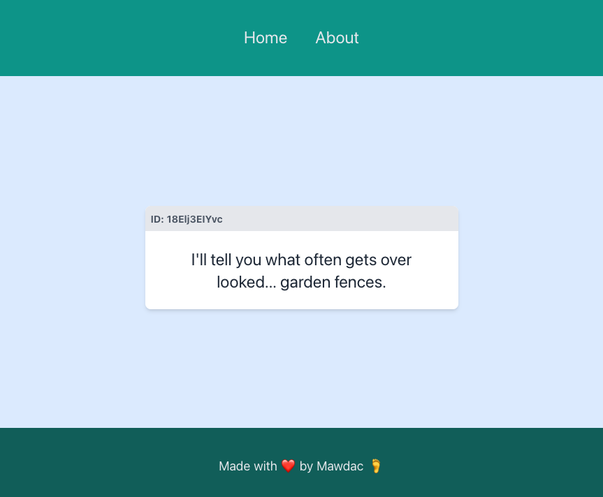

# 👨

This is a full-stack golang dad joke application. Everything you've ever
dreamed of.



It pulls dad jokes from the web, stores them in a local mongoDB instance, and
allows you to view them from a simple UI in your browser. The UI refreshes
every 5s, so each time you run the `collector` service, you'll get a new joke
and see it appear.

Each component is written with go. This is a work-in-progress, meant only to be
a project for learning full-stack go apps. Feel free to poke around.

## Development

### Pre-requisites

- Docker & Docker Compose
- go 1.22.0+

### Backend

From the root of the project, just run `docker compose up -d` to start all of
the backend components.

The `collector` service will immediately exit after it runs and collects 1
joke. To collect more jokes, simply run the same `up` command again:

### Frontend

First you'll need the tailwindcli standalone binary, you can use my install
script to make it real ez if you have
[gum](https://github.com/charmbracelet/gum).

```sh
./ui/install.sh
```

The frontend runs separately currently. To run it with hot-reloading, first
install [air](https://github.com/cosmtrek/air)

```sh
go install github.com/cosmtrek/air@latest
```

Then you can run the UI using it (assuming you've added the `$GOPATH/bin`
folder to your path)

```sh
cd ui/
air
```

## Architecture

### Collectors

Collects dad jokes from [the internetz](https://icanhazdadjoke.com) and writes
it to the database via the API. Each time it runs, a new joke is added.

### API

Written with Gin, allows read and write of jokes to the database.

### Database

MongoDB

### UI

Server-side rendered HTML. The API that serves up the UI is written with Chi
(because why not try something different)

- [Templ](https://templ.guide/)
- [Tailwind](https://tailwindcss.com/)
- [HTMX](https://htmx.org/)

### Diagram


## TODO

- [ ] Add tests
- [ ] Add a makefile
